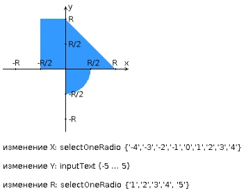
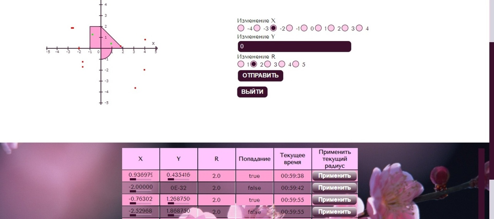

# Web3_Ant_IVY
Разработать приложение на базе JavaServer Faces Framework, которое осуществляет проверку попадания точки в заданную область на координатной плоскости.

Приложение должно включать в себя 2 facelets-шаблона - стартовую страницу и основную страницу приложения, а также набор управляемых бинов (managed beans), реализующих логику на стороне сервера.

Стартовая страница должна содержать следующие элементы:

"Шапку", содержащую ФИО студента, номер группы и номер варианта.
Интерактивные часы, показывающие текущие дату и время, обновляющиеся раз в 9 секунд.
Ссылку, позволяющую перейти на основную страницу приложения.
Основная страница приложения должна содержать следующие элементы:

Набор компонентов для задания координат точки и радиуса области в соответствии с вариантом задания. Может потребоваться использование дополнительных библиотек компонентов - ICEfaces (префикс "ace") и PrimeFaces (префикс "p"). Если компонент допускает ввод заведомо некорректных данных (таких, например, как буквы в координатах точки или отрицательный радиус), то приложение должно осуществлять их валидацию.
Динамически обновляемую картинку, изображающую область на координатной плоскости в соответствии с номером варианта и точки, координаты которых были заданы пользователем. Клик по картинке должен инициировать сценарий, осуществляющий определение координат новой точки и отправку их на сервер для проверки её попадания в область. Цвет точек должен зависить от факта попадания / непопадания в область. Смена радиуса также должна инициировать перерисовку картинки.
Таблицу со списком результатов предыдущих проверок.
Ссылку, позволяющую вернуться на стартовую страницу.

Дополнительные требования к приложению:

Все результаты проверки должны сохраняться в базе данных под управлением СУБД PostgreSQL.
Для доступа к БД необходимо использовать JPA.
Для управления списком результатов должен использоваться Application-scoped Managed Bean.
Конфигурация управляемых бинов должна быть задана с помощью аннотаций.
Правила навигации между страницами приложения должны быть заданы в отдельном конфигурационном файле.

Написать сценарий для утилиты Apache Ant, реализующий компиляцию, тестирование и упаковку в war-архив кода проекта из лабораторной работы №3 по дисциплине "Программирование интернет-приложений".

Каждый этап должен быть выделен в отдельный блок сценария; все переменные и константы, используемые в сценарии, должны быть вынесены в отдельный файл параметров.
Cценарий должен реализовывать следующие цели (targets):
compile - компиляция исходных кодов проекта.

build - компиляция исходных кодов проекта и их упаковка в исполняемый war-архив. Компиляцию исходных кодов реализовать посредством вызова цели compile.

clean - удаление скомпилированных классов проекта и всех временных файлов (если они есть).

test - запуск junit-тестов проекта. Перед запуском тестов необходимо осуществить сборку проекта (цель build).

xml - валидация всех xml-файлов в проекте.
